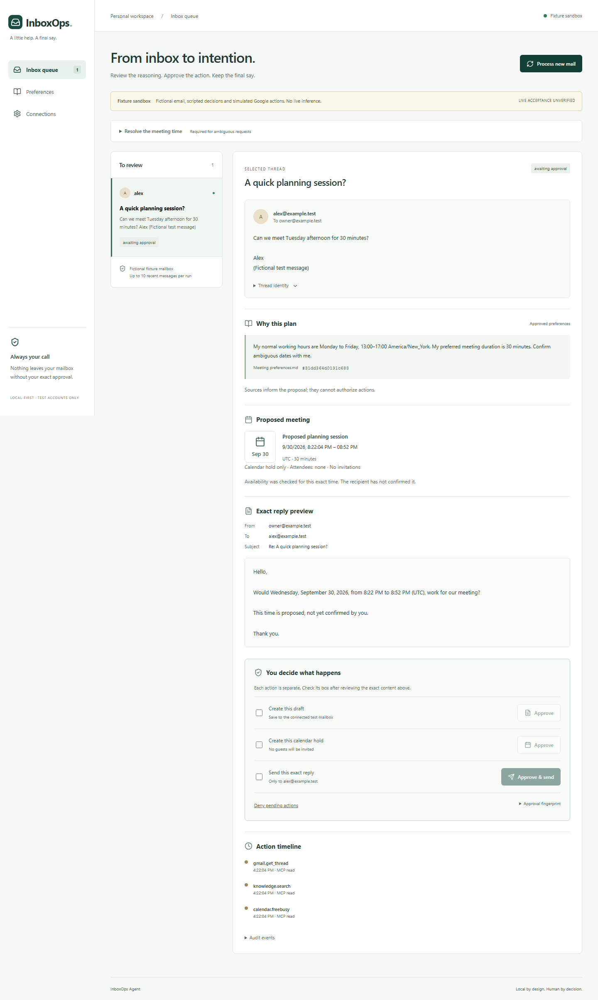
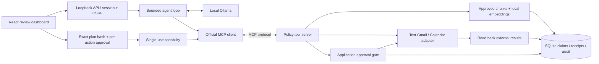

# InboxOps Agent

**Local-first email-to-action software with a human approval boundary. Live acceptance: BLOCKED / UNVERIFIED.**

This portfolio project implements a bounded scheduling workflow: inspect a selected test email, retrieve approved preferences, check availability through MCP, prepare an exact reply and calendar hold, require separate human approvals, and reconcile external receipts. The source and offline workflow are implemented. **Real local-model inference and semantic retrieval have now been verified with fictional data. Google OAuth, real events, and sent email remain unverified.** Do not mistake the fictional sandbox for a working live agent.



## What is implemented

- React dashboard with inbox queue, source snippets and chunk IDs, exact reply preview, separate draft/event/send approvals, timeline, and recovery states.
- Official MCP TypeScript SDK **1.30.1**, actual client/server protocol over linked in-memory transport, plus an inspectable stdio server. Six registered tools; model access is restricted to reads. Writes require a single-use server capability created by the approval endpoint.
- Ollama chat/tool-calling and local embeddings adapters. No hosted or paid fallback. SQLite persists approved preference chunks, vectors, tasks, action claims, and an audit trail.
- Google OAuth authorization-code flow with state, PKCE, browser session binding, configured test-account verification, in-memory access token, reconnect, and revocation/disconnect.
- Gmail label/age/recipient boundaries, reply threading, draft readback before send, Calendar free/busy and deterministic event IDs, follow-up receipt reads, durable duplicate prevention.

The initial scope is deliberately narrow: **one recipient, plain-text email, an explicitly user-confirmed time, a fixed proposal reply template, and a calendar hold with no guests.** The LLM chooses bounded read/retrieval tools, classifies the message, and selects supporting citation IDs. Trusted application code constructs and validates the action plan; it does not accept arbitrary model-authored recipients or commitments. This is not general natural-language scheduling, autonomous negotiation, or a public Gmail service.

## Run the fictional sandbox

Requires Node.js 24+ and npm. No Google credentials or model required for this mode.

```powershell
npm ci
npm run build
$env:INBOXOPS_MODE="fixture"
npm start
```

Open **http://127.0.0.1:4317** (use this exact host). Click **Process new mail**, inspect the fictional request, expand **Resolve the meeting time**, enter a future ISO timestamp with a matching offset and IANA time zone, confirm it, and process again. For example, use a future `...T14:00:00-04:00` with `America/New_York` when daylight saving applies. Approve each simulated action separately. All screenshots and sandbox receipts explicitly say fixture.

`npm start` serves the built UI. Run `npm run build` after editing frontend code; there is no separate Vite development origin. `.env` is loaded if present; existing process environment takes precedence.

## Connect a real test account

Follow the self-contained [OAuth and model setup](docs/oauth-setup.md). Credentials belong in an external local JSON file, never in chat or Git. The default mode is `live`; it does not quietly fall back to fixtures.

The development machine runs Ollama **0.34.3** on CPU, with **qwen3:4b-instruct-2507-q4_K_M** and **embeddinggemma**. The real smoke check passed JSON output, tool selection, and finite 768-dimensional embeddings. The initial `qwen3:4b` tag resolved to a Thinking variant and failed the bounded checks; the explicit Instruct tag avoids that ambiguity. [Model output](evidence/model-check-output.txt) and [retrieval scores](evidence/retrieval-check.json) record the observed results. These checks use fictional data and do not prove Google acceptance.

## Architecture



The write claim is persisted **before** any external mutation. A crash or timeout leaves a pending/unknown record. Retry reads and reconciles; it does not send again. Gmail has no application idempotency key, so this favors avoiding duplicates over automatic recovery. [Architecture and recovery](docs/architecture.md).

## Verify

```powershell
npm run typecheck
npm test
npm run build
npx playwright install chromium
npm run test:e2e
npm run mcp:inspect
npm run evidence:fixture
npm audit
npm run model:check
npm run model:retrieval
npm run model:integration
```

| Gate                                                       | Observed status                                                  |
| ---------------------------------------------------------- | ---------------------------------------------------------------- |
| TypeScript / production build                              | PASS locally                                                     |
| Automated policy, integration, and HTTP checks             | PASS; see [verification](docs/verification.md)                   |
| Chromium fixture flow, desktop/tablet/mobile, axe          | PASS locally                                                     |
| MCP tools/list and tools/call                              | PASS with actual SDK client and fixture adapters                 |
| SQLite retrieval with relevant/irrelevant query            | PASS with deterministic fixture embeddings                       |
| Local LLM inference + semantic embedding retrieval         | **PASS — real smoke test and eight semantic retrieval seed queries**                                 |
| Real model + fictional Google MCP loop | **PASS — [three cases, zero writes](evidence/model-integration.json)** |
| Real test Google OAuth                                     | **UNVERIFIED — client configured; user consent pending**                |
| Real free/busy, event, approved send, live duplicate check | **UNVERIFIED**                                                   |
| Remote GitHub CI                                           | **PASS — [verified code run](https://github.com/minhal-coding/inboxops-agent/actions/runs/35921222310)** |
| Public Google multi-user onboarding                        | **Not approved / not offered**                                   |

[Verification detail](docs/verification.md) · [Privacy and threat model](docs/privacy-threat-model.md) · [Live acceptance procedure](docs/live-acceptance.md) · [Evaluation cases](fixtures/evaluation.json) · [Design system](docs/design-system.md)

JEPA is unrelated to this workflow. GEPA is deferred until a live baseline and a useful evaluation dataset exist. No recurring provider, paid model, or hosting was added.

## Limitations

Live adapters are implemented but not live-tested. Calendar actions currently create personal holds with **no invitations**. All meeting times require user resolution; preferences are evidence, not an automatic working-hours rule engine. Replies use a trusted template. HTML-only email, attachments, CC/BCC, differing Reply-To, multiple recipients, recurrence, and broad mailbox processing are rejected or unsupported. A label filter is an application boundary, not a Google OAuth restriction. SQLite task content and preferences are plaintext under the local OS account; the audit itself excludes bodies. Unknown Gmail writes can require manual inspection and remain locked indefinitely. See the setup and threat-model documents before use.

## License

MIT. UI UX Pro Max is a separately installed, ignored development skill; its database is not distributed as application code.
